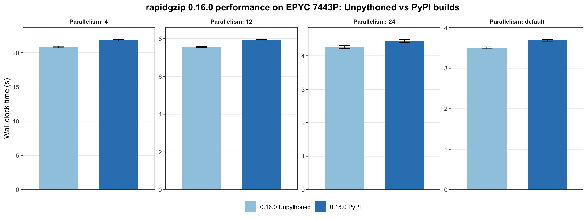

# rapidgzip-unpythoned

[](https://github.com/clinbiolab/rapidgzip-unpythoned/actions/workflows/ci.yml)

**A native, standalone build of rapidgzip. No Python environment required.**

[rapidgzip](https://github.com/mxmlnkn/rapidgzip) is a fast parallel gzip decompressor with a native C++ command-line implementation. `rapidgzip-unpythoned` builds that CLI directly from pinned rapidgzip sources and produces an ordinary executable that can be run from the shell or used as a decompression engine by other software.

`rapidgzip-unpythoned` is **not a fork of rapidgzip**. It keeps rapidgzip and its bundled dependencies as pinned, unmodified source and provides a separate build harness around them.

The current production build supports **Linux x86-64**.

## Installation

On Debian-based systems, install the required build tools:

```bash
apt-get update
apt-get install --no-install-recommends git cmake make clang-19 llvm-19 nasm
```

Then clone the repository recursively and build:

```bash
git clone --recursive https://github.com/clinbiolab/rapidgzip-unpythoned.git
cd rapidgzip-unpythoned
make
```

The resulting executable is:

```text
build/rapidgzip
```

Check the build with:

```bash
./build/rapidgzip --version
```

The required copies of zlib-ng, ISA-L, rpmalloc, cxxopts, and librapidarchive are already pinned through the recursive rapidgzip source tree. They do not need to be installed separately.

Most importantly, the build requires **no Python, pip, virtual environment, Conda, or Python development packages**.

## Usage

The resulting executable is rapidgzip's own native command-line program, with its normal command-line interface and options:

```bash
./build/rapidgzip --help
```

Decompress a gzip file to standard output:

```bash
./build/rapidgzip -d -c reads.fastq.gz > reads.fastq
```

Or read compressed data from standard input:

```bash
cat reads.fastq.gz | ./build/rapidgzip -d > reads.fastq
```

This makes it suitable both for direct command-line use and as an external decompression engine for other software.

## Performance

Somewhat surprisingly, the unpythoned build was consistently faster than the official PyPI distribution of rapidgzip 0.16.0 on the tested system. On an AMD EPYC 7443P, decompressing the same gzip-compressed FASTQ dataset to `/dev/null`, mean wall-clock time was lower by 4.65% at 4 decoder threads (95% CI: 4.58–4.72%), 4.83% at 12 threads (4.79–4.86%), 4.18% at 24 threads (4.06–4.30%), and 5.21% with the default parallelism (5.14–5.29%).

The benchmark used 500 runs per configuration, with run order randomized and the input stored on tmpfs to minimize I/O variability. Bars show mean wall-clock time; error bars show ±1 SD. The confidence intervals above are paired across benchmark rounds.



The dataset was a 6.3 GB concatenation of four gzipped FASTQ files from the publicly available [GIAB NA12878 exome dataset](https://ftp.ncbi.nlm.nih.gov/ReferenceSamples/giab/data/NA12878/Garvan_NA12878_HG001_HiSeq_Exome/):

```sh
cat \
NIST7035_TAAGGCGA_L001_R2_001_trimmed.fastq.gz \
NIST7035_TAAGGCGA_L002_R2_001_trimmed.fastq.gz \
NIST7086_CGTACTAG_L001_R2_001_trimmed.fastq.gz \
NIST7086_CGTACTAG_L002_R2_001_trimmed.fastq.gz \
> Garvan_NA12878_HG001_HiSeq_Exome_concatenated_R2.fastq.gz
```

SHA-256: `eb8bcfd8612b0ccadb2252f42a5645f5923e2f043403ebf1e5c91aa82cfb817d`

## Testing

Run the focused test suite with:

```bash
make test
```

The tests exercise the native command-line program, file and standard-input decompression, and the expected production binary configuration.

The Linux build has also been compared directly with the official rapidgzip 0.16.0 PyPI executable. For valid gzip input, both produced byte-identical decompressed output.

A separate error-behavior comparison covered:

* corrupted DEFLATE data
* truncated gzip streams
* CRC mismatches
* missing gzip footers
* trailing garbage
* valid empty gzip members
* zero-byte files
* plaintext files carrying a `.gz` name

For every tested case, the native executable and the PyPI version returned the same exit status and emitted exactly the same stdout bytes, including partial output from damaged streams.

Their error messages differ only at the launcher boundary: the native executable reports the C++ error directly, while the Python-distributed CLI may present the same failure through a Python/Cython traceback.

## Build design

rapidgzip already contains a complete native C++ CLI. This repository builds that existing implementation directly rather than recreating its command-line interface or decompression logic.

The Linux x86-64 production build uses the pinned rapidgzip 0.16.0 source tree together with its corresponding:

* librapidarchive implementation
* zlib-ng
* ISA-L
* rpmalloc
* cxxopts

ISA-L provides the optimized x86-64 inflate implementations and runtime CPU dispatch used by the production build.

The build also preserves the relevant release configuration, including optimization and LTO, PIE and binary hardening, and static linkage of the bundled native components and C++ runtime where intended.

All generated files are written under:

```text
build/
```

Nothing is generated inside the rapidgzip source tree or its nested dependency repositories.

To remove the complete generated build state:

```bash
make clean
```

or:

```bash
rm -rf build
```

## Recursive checkout

The rapidgzip source tree contains nested Git submodules, so the initial clone should use `--recursive`.

If the repository was cloned without them, initialize the pinned submodules explicitly:

```bash
git submodule update --init --recursive
```

The build system itself never runs Git, downloads missing dependencies, or updates submodules. An incomplete checkout causes configuration to fail instead.

## Direct CMake build

The Makefile is a convenience wrapper around CMake. The equivalent production build is:

```bash
CC=clang-19 CXX=clang++-19 \
  cmake -S . -B build -DCMAKE_BUILD_TYPE=RelWithDebInfo

cmake --build build --parallel
ctest --test-dir build --output-on-failure
```

The normal `make` workflow selects the same clang-19 production configuration automatically.

## Platform support

The current production harness supports and has been validated on **Linux x86-64**.

Other platforms need their own build policies rather than blindly reusing the Linux configuration. In particular, rapidgzip's macOS production build differs in its use of ISA-L, while Windows has its own compiler, assembler, runtime-linkage, and large-object requirements.

macOS and Windows support are therefore planned as separate platform-specific build targets.

## Relationship to rapidgzip

This repository exists to make rapidgzip's native command-line implementation convenient to build and distribute as a normal standalone executable.

The rapidgzip source itself remains pinned and unmodified. New rapidgzip versions can therefore be adopted deliberately by updating the pinned source revision and reviewing the corresponding production build graph.

The currently pinned rapidgzip release is **0.16.0**.

## AI use disclosure

`rapidgzip-unpythoned` was developed with extensive assistance from OpenAI Codex and ChatGPT, including build-system investigation, implementation, testing, compatibility validation, performance investigation, and documentation. Project goals, validation requirements, and final design decisions were human-directed.

## Acknowledgments

rapidgzip and librapidarchive are developed by their original authors. `rapidgzip-unpythoned` provides a separate build and distribution layer for their native command-line implementation.

## License

`rapidgzip-unpythoned` is licensed under the [Apache License 2.0](LICENSE).

rapidgzip and the third-party components included through its pinned source tree retain their respective licenses.

